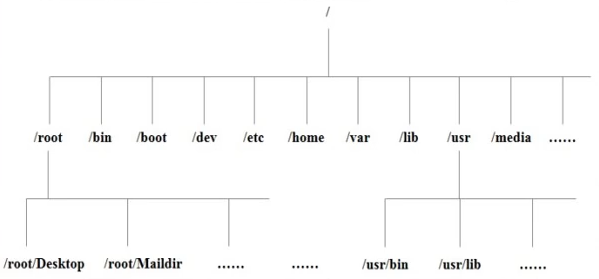
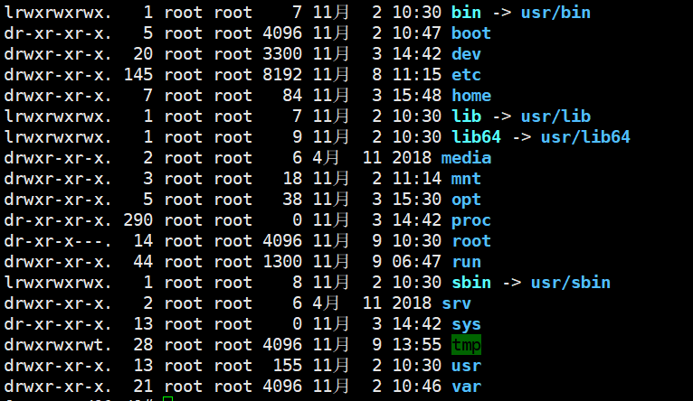
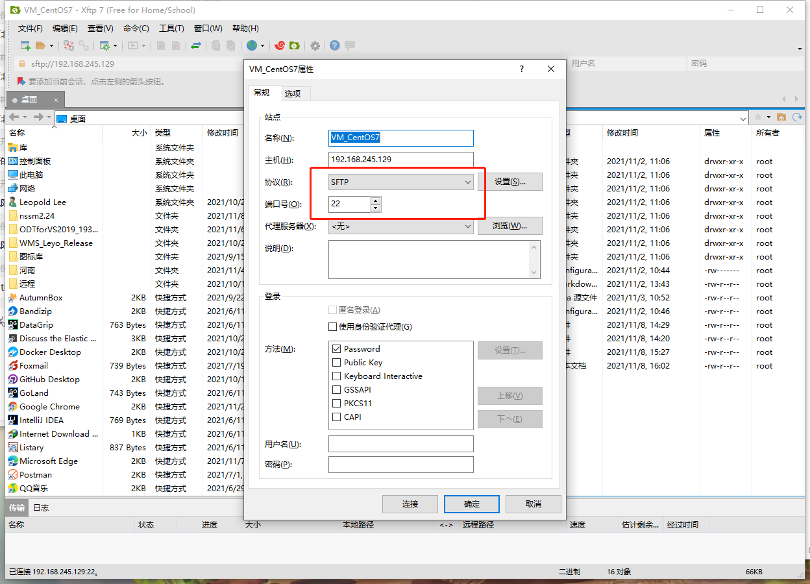
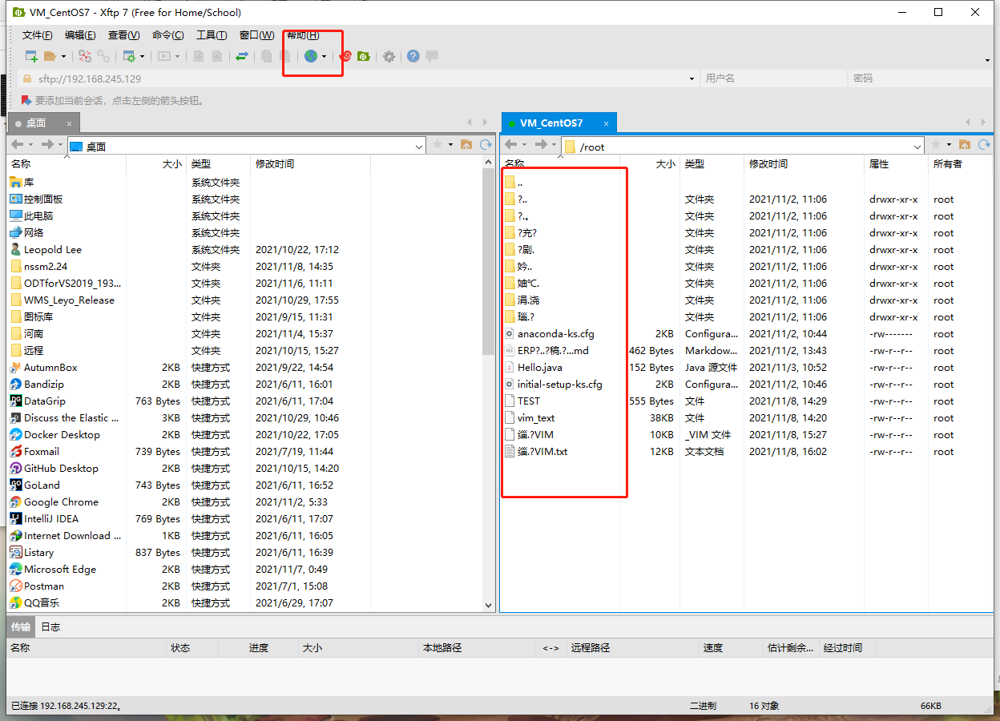

# 2021韩顺平图解linux_学习笔记

## 一、Linux目录结构

###### Linux世界里，一切皆文件

- /bin：是Binary的缩写，这个目录存放着最经常使用的命令。
- /sbin：s就是Super User的意思，这里存放的是系统管理员使用的系统管理程序。
- /home：存放普通用户的主目录，在Linux中每个用户都有一个自己的目录，一般该目录名是以用户的账号命名的。
- /root：该目录为系统管理员，也称作超级权限者的用户主目录。
- /lib：系统开机所需要最基本的动态连接共享库，其作用类似于Windows里的DLL文件。几乎所有的应用程序都需要用到这些共享库。
- /lost+found：这个目录一般情况下是空的，当系统非法关机后，这里就存放了一些文件。
- /etc：所有的系统管理所需要的配置文件和子目录my.conf。
- /usr：这是一个非常重要的目录，用户的很多应用程序和文件都放在这个目录下，类似与windows下的program files目录。
- /boot：存放的是启动Linux时使用的一些核心文件，包括一些连接文件以及镜像文件。
- /proc：这个目录是一个虚拟的目录，它是系统内存的映射，访问这个目录来获取系统信息。
- /srv：service的缩写，该目录存放一些服务启动之后需要提供的数据。
- /sys：这是linux2.6内核的一个很大的变化。该目录下安装了2.6内核中新出现的一个文件系统sysfs。
- /tmp：这个目录是用来存放一些临时文件的。
- /dev：类似windows的设备管理器，把所有的硬件用文件的形式存储。
- /media：linux系统会自动识别一些设备，例如U盘光驱等等，当识别后，linux会把识别的设备挂载到这个目录下。
- /mnt：系统提供该目录是为了让用户临时挂载别的文件系统的，我们可以将外部的存储挂载在/mnt/上，然后进入该目录就可以查看里面的内容了。
- /opt：这是给主机额外安装软件所摆放的目录，如安装ORACLE数据库就可放到该目录下。默认为空。
- /usr/local：这是另一个给主机额外安装软件所安装的目录，一般是通过编译源码的方式安装的程序。
- /var：这个目录中存放着在不断扩充着的东西，习惯将经常被修改的目录放在这个目录下，包括各种日志文件。
- /selinux：SELinux是一种安全子系统，它能控制程序只能访问特定文件。

###### bin、lib、lib64、sbin目录是软连接目录

##### 总结

1. Linux的目录中有且只有一个根目录。
2. Linux的各个目录存放的内容是规划好，不用乱放文件。
3. Linux是以文件的形式管理我们的设备，因此linux系统，一切皆为文件。
4. Linux的各个文件目录下存放什么内容，必须有一个认识。

## 二、Linux远程登录

###### 工具下载地址：https://www.netsarang.com/en/free-for-home-school/

##### Xftp相关设置

###### 端口与协议设置

###### 乱码设置

## 三、Vim编辑器

##### 快速入门

- yy：拷贝当前行
- 5yy：拷贝当前5行
- dd：删除当前行
- 5dd：删除当前行向下的5行
- 在文件中查找某个单词：命令行输入 /（查找内容），按n查找下一个
- 设置文件行号：set nu，取消文件行号：set nonu
- 编辑文件，正常模式下使用快捷键到达文档最末行：G，最首行：gg
- 撤销输入：在正常模式下输入u
- 编辑文件，光标移动到某行：shift+g
  - 显示行号：set nu
  - 输入行号这个数
  - 输入shift+g

### 练习工具

###### 1.linux自带vimtutor

###### 2.自定义练习工具:https://github.com/LeeLeopold/StudyNotes/Linux/doc/Vim.txt

## 四、使用指令

### 1.关机重启、登录注销

##### 关机、重启命令

|    执行动作     |        所在模式         |
| :-------------: | :---------------------: |
| shutdown -h now |      立刻进行关机       |
|    shutdown     | 1分钟后会关机(等同下面) |
|  shutdown -h 1  |      1分钟后会关机      |
| shutdown -r now |   现在重新启动计算机    |
|      halt       |  关机，作用和上面一样   |
|     reboot      |   现在重新启动计算机    |
|      sync       |  将内存数据同步到磁盘   |
|     init 0      |        运行指令         |

##### 登录注销

###### logout：注销用户，在图形运行级别无效，在运行级别3有效。

###### su ：切换用户，su - 切换用户名，**从权限高切换到权限低的用户不需要输密码**。

### 2.用户管理

#### 基本介绍：

1. Linux系统是一个多用户多任务的操作系统，任何一个要使用系统资源的用户，都必须首先向系统管理员申请一个账号，然后以这个账号的身份进入系统
2. Linux的用户需要至少要属于一个组

##### 用户相关操作

| 操作                 | 命令                       | 说明                                     |
| -------------------- | -------------------------- | ---------------------------------------- |
| 添加用户             | useradd 用户名             | 创建用户成功后，会创建和用户同名的家目录 |
| 添加用户(指定家目录) | useradd -d 指定目录 用户名 |                                          |
| 修改密码             | passwd 用户名              | 不指定用户名修改的是当前用户的密码       |
| 删除用户             | userdel 用户名             | 一般保留家目录                           |
| 删除用户及家目录     | userdel -r 用户名          |                                          |
| 用户信息             | id 用户名                  |                                          |
| 当前用户信息         | whoami 和 who am i         |                                          |
| 切换用户             | su - 用户名                | su- 切换了用户和Shell环境，su 切换身份   |

#####  用户组相关操作

[^用户组]: 用户组相当于角色

| 操作           | 命令                   | 说明 |
| -------------- | ---------------------- | ---- |
| 新增组         | groupadd 组名          |      |
| 新增用户指定组 | useradd -g 组名 用户名 |      |
| 修改用户组     | usermod -g 组名 用户名 |      |

##### 用户和组相关文件

###### /etc/passwd 文件

- 用户（user）的配置文件，记录用户的各种信息。
- 每行的含义：用户名：口令：用户标识号：注释性描述：主目录：登录shell

###### /etc/shadow 文件

- 口令配置文件

- 每行的含义：登录名：加密口令：最后一次修改时间：最小时间间隔：最大时间间隔：警告时间：不活动时间：失效时间：标志

  

###### /etc/group 文件

- 组（group）的配置文件，记录Linux包含的组的信息
- 每行含义：组名：口令：组标识号：组内用户列表

### 3.运行级别

- 指定运行级别（7个级别）

  0：关机

  1：单用户【找回丢失密码】

  2：多用户状态没有网络服务

  3：多用户状态有网络服务

  4：系统未使用保留给用户

  5：图形界面

  6：系统重启

###### 切换到指定运行级别的指令：init [012356]

###### 查看运行级别 systemctl get-default

###### 设置运行级别 systemctl set-default multi-user.target

### 4.帮助指令

| 指令 | 功能                        | 说明 |
| ---- | --------------------------- | ---- |
| man  | 获得帮助命令信息            | 外部 |
| help | 获得shell内置命令的帮助信息 | 内置 |

### 5.目录指令

| 指令  | 功能                                | 说明                                            |
| ----- | ----------------------------------- | ----------------------------------------------- |
| pwd   | 显示当前工作目录的绝对路径          | print working directory                         |
| ls    | 显示当前所有的文件和目录,包括隐藏的 | -l，以列表的形式显示                            |
| cd    | cd ~回到家目录，cd..上一级目录      |                                                 |
| mkdir | 创建目录                            | mkdir -p /home/animal/tiger 多级                |
| rmdir | 删除空目录                          | rm -rf /home/animal                             |
| touch | 创建空文件                          | 可以一次性创建多个文件                          |
| cp    | copy文件到指定目录                  | cp -r 递归，/cp 强制复制                        |
| rm    | 删除文件或目录                      | -r,递归删除整个文件夹；-f,强制删除不提示        |
| mv    | 移动文件与目录或重命名              | mv old new;mv /sourpath /dest                   |
| cat   | 查看文件内容                        | -n 显示行号                                     |
| echo  | 输入内容                            |                                                 |
| head  | 显示头部部分内容                    | head -n 5;5行内容，默认10                       |
| tail  | 显示尾部部分内容                    | tail -n 5;5行内容，默认10；tail -f,实时监控内容 |
| >     | 输出重定向                          | 不存在会创建文件，否则覆盖                      |
| >>    | 追加                                | 不存在会创建，否则追加在尾部                    |
| ln    | 软连接                              | ln  -s  /root myroot                            |

| 指令    | 功能         | 说明   |
| ------- | ------------ | ------ |
| date    | 显示当前日期 | YmdHMS |
| date -s | 设置系统时间 |        |
| cal     | 显示当前日历 |        |

### 6.查找指令

###### find 将从指定目录向下递归遍历各个子目录，将满足条件的文件或目录显示出来

| 选项  | 功能                   | 说明     |
| ----- | ---------------------- | -------- |
| -name | 按照指定的文件名       | 查询方式 |
| -user | 查找指定用户名所有文件 | 用户名   |
| -size | 指定大小查找           |          |

###### locate 快速定位文件路径 第一次运行前使用updatedb 创建locate数据库

| 选项   | 功能 | 说明 |
| ------ | ---- | ---- |
| locate |      |      |
| which  |      |      |

###### grep 过滤查找

| 选项 | 功能             | 说明 |
| ---- | ---------------- | ---- |
| -n   | 显示匹配行及行号 |      |
| -i   | 忽略字母大小写   |      |

### 7.压缩与解压

###### gzip/gunzip

| 指令   | 功能         | 说明         |
| ------ | ------------ | ------------ |
| gzip   | 压缩位gz文件 | 源文件不保留 |
| gunzip | 解压缩       | 源文件不保留 |

###### zip/unzip

| 指令  | 功能                                            | 说明        |
| ----- | ----------------------------------------------- | ----------- |
| zip   | 压缩文件、文件夹（zip -r myhome.zip /home）     | -r 递归压缩 |
| unzip | 解压文件（unzip -d /opt/temp /home/myhome.zip） | -d          |

###### tar指令

| 选项 | 功能               | 说明 |
| ---- | ------------------ | ---- |
| -c   | 产生tar打包文件    |      |
| -v   | 显示详细信息       |      |
| -f   | 指定压缩后的文件名 |      |
| -z   | 打包同时压缩       |      |
| -x   | 解包tar文件        |      |

## 五、组与权限

- 文件：

  所有者

  所在组

  其他组

  改变用户所在组

- 文件/目录所有者：

  一般为文件的创建者，谁创建了该文件，就自然的称为该文件的所有者。

  查看文件所有者：ls -ahl

  修改文件所有者：chown (用户名) (文件名)

  文件所在组不一定是文件所有者。

| 指令                     | 功能           | 说明 |
| ------------------------ | -------------- | ---- |
| groupadd 组名            | 组的创建       |      |
| chgrp                    | 修改文件所在组 |      |
| usermod -g 新组名 用户名 | 改变用户所在组 |      |

- 文件类型：
  1. -：普通类型
  2. d：目录
  3. l：软连接
  4. c：字符设备【键盘、鼠标等】
  5. b：块文件【硬盘】

- rwx作用到文件：
  - r：read，可读。读取查看。
  - w：write，可以修改。但不代表可以删除该文件。删除一个文件的前提条件是对该文件所在的目录有写权限，才能删除该文件。
  - x：execute，可执行。可以被执行。
- rwx作用到目录：
  - r：可以读取，ls查看目录内容。
  - w：可以修改，目录内创建+删除+重命名目录。
  - x：可执行，可以进入该目录。

- 修改权限 chmod
  - 修改文件或者目录的权限
  - u：所有者；g：所在组；o：其他人；a：所有人（u、g、o的总和）
  - chmod u=rwx，g=rx，o=x 文件目录名：分别权限
  - chmod o+w 文件目录名：给其他人都增加写的权限
  - chmod a-x 文件目录名：给所有的用户都减掉执行权限

- 修改文件所有者 chown

  - chown newowner file：改变文件的所有者
  - chown newowner：newgroup file：改变用户的所有者和所在组
  - -R：如果是目录，则使其下所有子文件或目录递归生效

  

- 修改文件所在组 chgrp

  - chgrp newgroup file：改变文件的所有组
  - -R：如果是目录，则使其下所有子文件或目录递归生效

## 六、定时任务调度

crond任务调度：crontab进行定时任务调度

- crontab [选项]
- -e：编辑crontab定时任务
- -i：查询crontab任务
- -r：删除当前用户所有的crontab任务
- -l：列出当前有哪些任务调度
- service crond restart：重启任务调度
- 当保存退出后就生效了
- 参数细节说明

| 项目      | 含义                 | 范围                    |
| --------- | -------------------- | ----------------------- |
| 第一个“*” | 一小时当中的第几分钟 | 0-59                    |
| 第二个“*” | 一天当中的第几小时   | 0-23                    |
| 第三个“*” | 一个月当中的第几天   | 1-31                    |
| 第四个“*” | 一年当中的第几月     | 1-12                    |
| 第五个“*” | 一周当中的星期几     | 0-7（0和7都代表星期日） |

- 特殊符号说明
  - `*`：代表任何时间。比如第一个`*`就代表一小时中每分钟都执行一次的意思。
  - `,`：代表不连续的时间。比如“0 8,12,16 * * *命令”，就代表在每天的8点0分，12点0分，16点0分都执行一次命令。
  - `-`：代表连续的时间范围。比如“0 5 * * 1-6命令”，代表在周一到周六的凌晨5点0分执行命令。
  - `/n`：代表每隔多久执行一次。比如“*/10 * * * * 命令”，代表每隔10分钟就执行一遍命令。

## 七、Linux分区与挂载

## 八、网络

## 九、RPM与YUM

#### RPM

- RPM：RedHat Package Manager，红帽软件包管理工具。
- RPM查询已安装的rpm列表：rpm -qa | grep xx
- rpm包的其它查询指令：
  - rpm -qa：查询所安装的所有rpm软件包
  - rpm -qa | more
  - rpm -qa | grep xx
  - rpm -q xx：查询xx软件包是否安装
  - rpm -qi xx：查询软件包信息
  - rpm -ql xx：查询软件包中的文件
  - rpm -qf 文件全路径名：查询文件所属的软件包
- 卸载rpm包：rpm -e 软件包名称
- 删除时可能会发生依赖错误，忽视依赖强制删除的方法：rpm -e --nodeps 软件包名称
- 安装rpm包：rpm -ivh 软件包全路径名称
  - i=install：安装
  - v=verbose：提示
  - h=hash：进度条

#### YUM

- YUM：是一个shell前端软件包管理器。基于RPM包管理，能够从指定的服务器自动下载RPM包并安装，可以**自动处理依赖性关系**，并且一次安装所有依赖的软件包。使用yum的前提是联网。
- yum list | grep xx：查询yum服务器是否有需要安装的软件
- yum install xx：安装指定的yum包
- yum -y remove xx：卸载指定的yum包

